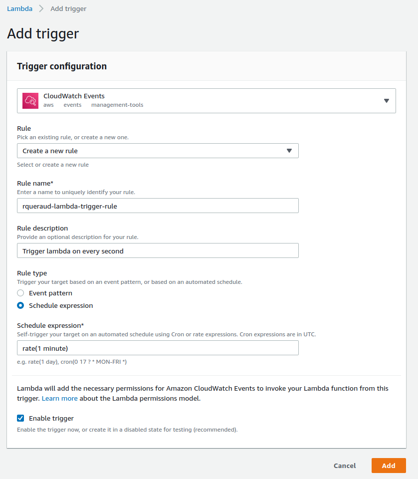

# INSEEC - TP2: AWS

Objectifs de ce cours : 
* S'exercer à python avec une suite d'exercices sur un notebook jupyter
* Utiliser les services AWS pour créer une chaîne de traitement de l'information

## Partie 0 : Rallumer son instance et accéder au notebook jupyter

Le notebook jupyter sera executé sur une instance EC2 sur AWS. Suivant votre avancée au dernier TP, vous pouvez :

* Si vous aviez un environnement fonctionnel : 
    * Redémarrez votre instance EC2. Pour rappel, allez sur http://console.aws.amazon.com, dans le service EC2, puis faites un clic-droit sur votre instance et *Instance State -> Start*.
* Si vous n'aviez pas d'environnement fonctionnel :
    * Allez sur http://console.aws.amazon.com puis choisissez le service EC2.
    * Selectionnez AMIs dans le menu de gauche. Les AMIs sont des images d'instances, c'est à dire que l'on a conservé uniquement le disque dur et qu'il n'est pour le moment rattaché à aucune instance.
    * Clic-droit sur l'AMI `rqueraud-jupyter-notebook` et *Launch*.
    * Selectionnez le type `t2.micro` puis *Review and Launch*.
    * Prenez le temps d'observer ce qui a été selectionné  dans le recapitulatif et cliquez sur *Launch*.
    * Selectionnez votre *key-pair* existant et cliquez sur *Launch Instances*.
    * Vous pouvez retrouver votre instance en train de démarrer en cliquant dans le menu de gauche *Instances*.
    * Suivez la Partie 5 du TP précédent (https://github.com/rqueraud/cours_aws_1#partie-2--ssh-avec-bitvise) pour autoriser l'accès à l'interface web de jupyter.

Connectez-vous en SSH à votre instance :
* Pour windows, voir la partie 2 du TP précédent : https://github.com/rqueraud/cours_aws_1#partie-2--ssh-avec-bitvise
* Pour mac, entrez la commande suivante dans votre terminal

```bash
# Commande pour se connecter en SSH depuis un Mac
ssh -i /chemin/vers/votre/cle ubuntu@IP-DE-VOTRE-INSTANCE
```

Une fois sur l'instance, récupérez le sujet de TP à l'url https://raw.githubusercontent.com/rqueraud/cours_aws_2/master/python-training-cours-2.ipynb grâce à la commande `wget` :

```bash
# Commande pour télécharger un fichier depuis une url
wget URL-DU-FICHIER-A-TELECHARGER
```

Relancez le service jupyter-notebook avec la commande :

```bash
# Commande pour lancer le service jupyter-notebook
jupyter-notebook
```

Vous pouvez maintenant accéder à l'interface web de jupyter depuis votre navigateur à l'adresse : http://IP-DE-VOTRE-INSTANCE:8888, mot de passe `a`. Puis ouvrir le fichier *python-training-cours-2.ipynb* depuis l'interface jupyter. 

*Note: Si vous avez un warning à l'ouverture du notebook indiquant des problèmes d'incompatibilité, vous pouvez l'ignorer. Ceci provient du fait que j'ai utilisé un outil différent pour créer ce notebook.*

## Partie 1 : Exercices de Python

Jupyter propose une interface où le code s'execute dans des cellules. Vous pouvez executer les cellules une à une ou tout executer en même temps.  
Attention cependant, car l'environnement python est conservé entre les différentes cellules. Une variable définie dans une cellule est donc accessible depuis une autre cellule.

Résolvez les problèmes du notebook en vous aidant des notions vues dans le *Problème 0*.

## Partie 2 : Création du Bucket S3

S3 est le service de stockage d'AWS.

Allez sur la page du service S3 et créez un nouveau bucket à votre nom en laissant tous les autres paramètres par défaut.

## Partie 3 : Le service Lambda

Lambda est un service de functions (FaaS), permettant d'executer du code court sans se soucier de l'environnement.

Nous disposons déjà d'un service sur une autre instance EC2 qui expose un nouveau tweet toutes les minutes. L'objectif de cette étape va être de récupérer ces tweets à intervalles réguliers et de les enregistrer sur S3.

Les étapes initiales sont :
* Depuis la console AWS, allez sur la page du service Lambda et créez une nouvelle fonction.
* Selectionnez Author from scratch, puis entrez un nom pour votre fonction (contenant votre prénom pour vous différencier des autres) et choisissez le langage Python 3.7.

Vous arrivez sur la page de développement de votre fonction lambda où vous pourrez écrire votre code. Les deux principales choses à retenir sont :
* Quand votre fonction sera appelée, la méthode executée sera la méthode *lambda_handler*. Il faut donc conserver la signature existante et insérer votre code dans cette méthode.
* Vous pouvez simuler une execution en cliquant sur *Test* en haut de la fenêtre. Vous aurez besoin pour tester de créer un *test event* vide car nous n'aurons pas d'inputs à notre fonction lambda.
* Il faut toujours cliquer sur *Save* avant de cliquer sur *Test* sinon votre fonction s'execute sans s'être mise à jour !

### Partie 3.1 : Configurer l'appel de la fonction

Nous allons configurer notre fonction lambda pour qu'elle soit appelée toutes les minutes.

Dans l'onglet Configuration de votre fonction, vous pouvez ajouter un trigger en cliquant sur *Add trigger*. Selectionnez un *CloudWatch Events* et créez une nouvelle règle comportant votre prénom et le *Rule type*: *Schedule expression* ayant pour valeur `rate(1 minute)`.  
Cette configuration est resumée dans la capture d'écran ci-dessous.


Vous pouvez ensuite cliquer sur *Add* pour créer le *trigger* et revenir à la fenêtre de code de votre fonction.

### Partie 3.2 : Importer les dépendances

Juste au-dessus de l'interface pour saisir du code, cliquez sur le menu déroulant de *Code entry type* et selectionnez *Upload a .zip file*. Uploadez le fichier *function.zip* depuis votre machine locale. Une fois selectionné, cliquez sur *Save* en haut à droite pour actualiser votre fonction.

### Partie 3.3 : Écriture du code

Vous allez editer le code du fichier `lambda_function.py` directement depuis l'éditeur de Lambda.

Pour aller récupérer un tweet sur le serveur et l'écrire sur S3, vous aurez besoin :
* de l'URL sur lequel récupérer un tweet : `http://52.213.154.80:5002/tweet` (Le tweet retourné change toutes les minutes).
* des méthodes pour aller requêter un json sur une url :
```python
import requests
URL = "MON_URL_COMPLETE"
r = requests.get(URL)  # Retourne un objet propre à la librairie `requests`
json_dict = r.json()  # Sur l'objet retourné, appeler la méthode `json` nous retourne un dictionnaire python correspondant à notre json
```
* des méthodes pour convertir un dictionnaire python en string en conservant le format json :
```python
import json
my_json_dict = {"key1": "value1", "key2": 2}
json_string = json.dumps(my_json_dict)
```
* des méthodes pour écrire une string dans un fichier sur S3 :
```python
import boto3
s3 = boto3.resource('s3')
s3.Bucket('LE_NOM_DE_MON_BUCKET').put_object(Key="MON_NOM_DE_FICHIER_A_ECRIRE", Body="MA_STRING_JSON")
```

Utilisez ces méthodes pour récupérer un tweet toutes les minutes (on a déjà mis en place le trigger à la section précédente) et écrire ce tweet dans un nouveau fichier sur S3. Ce fichier doit être unique, donc vous devrez un moyen d'avoir un nom de fichier variant à chaque appel de votre fonction lambda.

Votre fonction ne dispose pas encore des droits d'écriture sur S3. Si vous testez votre fonction, vous devriez donc vous prendre une erreur `AccessDenied`. Nous allons y remédier. 

### Partie 3.4 : Autoriser notre fonction Lambda à écrire sur S3

Les rôles IAM contrôlent les autorisations d'accès à des services AWS depuis d'autres services AWS. Par défaut, tous les échanges sont interdits, il nous faut donc autoriser notre fonction Lambda à appeler le service S3.

Pour cela :
* Notez le nom du rôle attribué à votre fonction Lambda (vous pouvez le trouver dans le cadre *Execution role* sur la page de développement, le miens est *service-role/rqueraud-example-role-...*).  
* Puis allez dans le service IAM et cliquez sur role dans le menu de gauche.
* Selectionnez votre role, cliquez sur *Attach policies* et attachez le role *AmazonS3FullAccess*.

## Partie 4 : Monter les données et les requêter avec Athena

Athena est un service permettre de se passer de la création d'une base de données. Les données sont ainsi montées et renvoyées lors de la requête.

Allez sur le service Athena dans AWS et adaptez puis executez la requête SQL suivante pour créer une nouvelle table qui aura accès à vos données:

```sql
CREATE EXTERNAL TABLE default.VOTRE_NOM (
  id int,
  text string,
  ...  -- Champs à compléter
)
ROW FORMAT SERDE 'org.openx.data.jsonserde.JsonSerDe'
WITH SERDEPROPERTIES ('ignore.malformed.json' = 'true')
LOCATION 's3://LE-BUCKET-S3-DANS-LEQUEL-SONT-STOCKEES-VOS-DONNEES';
```

Une fois votre table créée, vous pouvez l'intérroger avec des requêtes SQL classiques, par exemple : 

```sql
SELECT * FROM default.VOTRE_NOM
LIMIT 10
```

Ecrivez et executez la requête SQL permettant de compter le nombre total de tweets dans notre base.

## Partie 5 : Bonus

Améliorez la chaîne de traitement pour afficher les hashtags les plus présents dans la base.
